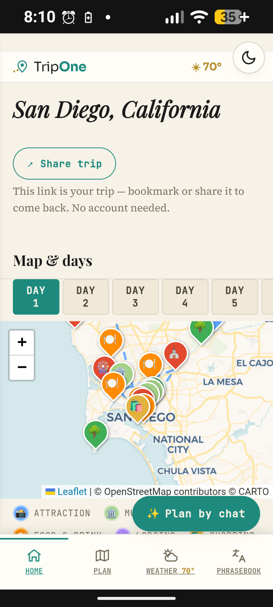
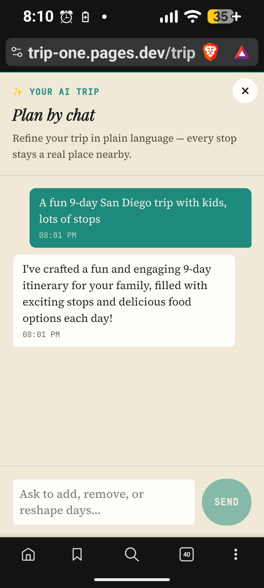
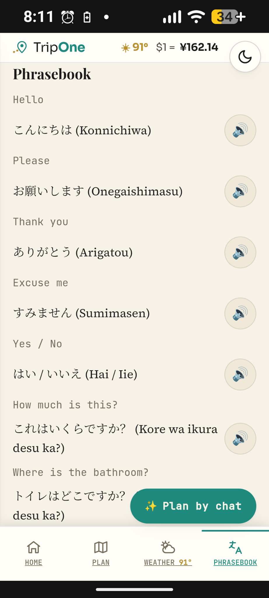

# Trip One

[](https://github.com/brianference/trip-one/actions/workflows/ci.yml)

**A public, grounded AI trip planner.** Describe a trip in one sentence and it
builds a real, day-by-day itinerary from actual places — then you refine it by
chatting. No account, no signup.

**Live:** https://trip-one.pages.dev

> The defining principle is **grounded generation**: the AI never invents a
> place. It is given a numbered list of real places (from Google Places and
> Tripadvisor) and may only select and order them by index. Any index outside
> the list is dropped, so a bad or hallucinated response degrades to a smaller
> plan — never a fake one. No invented places, menus, ratings, or reviews.

## Screenshots

<p align="center">
  
  &nbsp;
  
  &nbsp;
  
</p>

<p align="center"><sub>Trip home with a full-bleed map · the "Plan by chat" assistant · the phrasebook with real text-to-speech</sub></p>

## What it does

- **Describe your trip.** One sentence — "a fun 9-day San Diego trip with kids"
  — becomes a grounded, day-by-day itinerary end to end.
- **Refine by chat.** A persistent assistant on the itinerary. Ask it to add
  food stops, relax a day, or reshape the trip; ask open questions ("is this
  place good for kids?"); or change destination ("actually, make it Rome"). It
  routes each message to the right action and replies in plain language, with a
  live thinking indicator.
- **Plan from a place, not just chat.** Tap a place on the map or in the list
  for photos, rating and review count, price, hours, phone, a real summary and
  reviews, and Get Directions — then add it straight to a specific day, or see
  "On Day N" with a remove control if it's already on the trip.
- **Editable itinerary.** Each stop opens a compact editor: set a real clock
  time, move it to another day, or reorder it within the day. Nearby
  things-to-do filter by type, sort by rating, hide unrated noise, and badge
  what's already on your trip.
- **Dates and effort.** Add an optional start date to unlock day-date labels and
  date-aligned weather; each day shows its rough walking distance and time and
  warns when it's spread across town.
- **Reviewable AI.** A chat plan change lists what it added and offers one-tap
  Undo, so nothing changes your trip without a way back.
- **Real weather.** Current conditions, a multi-day forecast, and packing tips
  from Open-Meteo, with currency and transit for the destination.
- **Light and dark.** A top-right toggle that remembers your choice; light by
  default.
- **A real trip page, not one long scroll.** Home, Itinerary, Map, Things to
  do, and Weather are separate routes with working back/forward and deep links.

## How it works

```
Browser (Vite + React + TS)
  │  every place shown is real; the AI only orders real places
  v
Cloudflare Pages Functions  (functions/api/*)
  |- /api/location        geocode + fetch real things-to-do (cached in D1)
  |- /api/plan            grounded day-by-day planner (indices into real places)
  |- /api/plan-intent     extract {destination, days, interests} from free text
  |- /api/chat            conversational turn -> plan-edit | answer | relocate
  |- /api/place-details   Google Place Details, cached 30 days in D1
  |- /api/place-photo     photo proxy so the Google key never reaches the client
  |- /api/trips           create / read / update trips
  |- /api/currency        USD -> local rate
  |- /api/autocomplete    location suggestions
  v
Cloudflare D1     (locations, trips, place_details, interest_places, request_log)
OpenAI gpt-4o-mini . Google Places . Tripadvisor . Open-Meteo . OpenStreetMap
```

### The AI, specifically

- **Model:** OpenAI `gpt-4o-mini` via Chat Completions, configurable with the
  `AI_MODEL` env var. JSON mode, capped tokens, low temperature.
- **Grounded planner** (`/api/plan`): returns `{day, placeIndexes}` into the
  real candidate list; `normalizePlan` drops out-of-range/duplicate indices.
- **Conversational assistant** (`/api/chat`): classifies each message as a
  plan edit, a question, or a destination change, and only re-plans when asked.
- **Cost control:** rate limits per endpoint (IP hashed + salted), D1
  caching for locations and place details, small prompts and token caps.

### Data model

- `locations` — cached destination + real things-to-do (keyed by slug).
- `trips` — a trip's itinerary + length + design style (random UUID; the URL is
  the only key, no account).
- `place_details` — cached Google Place Details (keyed by place_id, 30-day TTL).
- `request_log` — hashed IP + endpoint, for rate limiting only.

## Tech stack

Vite, React 18, TypeScript (strict), Zustand, React Router v6, Leaflet, Zod,
Cloudflare D1 + Pages Functions. 515 tests (Vitest + Testing Library).
No secrets in the client; strict Content-Security-Policy.

## Project layout

```
functions/api/         Cloudflare Pages Functions (the backend)
functions/lib/         pure, unit-tested cores (aiPlan, aiChat, placeDetails, places)
src/features/trip/     trip pages, chat, place detail, planning, hooks
src/features/weather/  forecast hooks + packing tips
src/lib/               api client, itinerary logic, validation, theme
src/themes/chronicle/  the single active theme (CSS + landing page)
d1/schema.sql          D1 schema (supabase/migrations kept as history)
docs/                  FEATURES, TEST-CASES, GAP-ASSESSMENT
```

Small files by responsibility; pure logic is separated from I/O and tested
directly (`aiPlan`, `aiChat`, `placeDetails`, `planToItinerary`,
`experienceFilter`, `normalizePlan`).

## Develop

```bash
npm install
npm run dev        # Vite dev server
npm test           # Vitest
npm run build      # tsc -b && vite build
```

Backend functions and secrets (OpenAI, Google, Tripadvisor) run on Cloudflare
Pages; local API calls need those bindings. Secrets live in environment
variables / `.dev.vars`, never in the repo.

## Deploy

Cloudflare Pages, direct upload:

```bash
npm run build
npx wrangler pages deploy dist --project-name trip-one --branch main
```

`git push` updates the repo; it does not deploy — deploy and push are separate
steps.

## Privacy

No accounts, no ads, no tracking. Trips are stored under a random URL with no
personal data attached; IPs are hashed and salted for rate limiting only. Full
policy at [`/privacy`](https://trip-one.pages.dev/privacy).

## Docs

- [`docs/FEATURES.md`](docs/FEATURES.md) — per-feature reference
- [`docs/TEST-CASES.md`](docs/TEST-CASES.md) — test-case list
- [`docs/GAP-ASSESSMENT.md`](docs/GAP-ASSESSMENT.md) — comparison and roadmap

## License

MIT — see [`LICENSE`](LICENSE).
